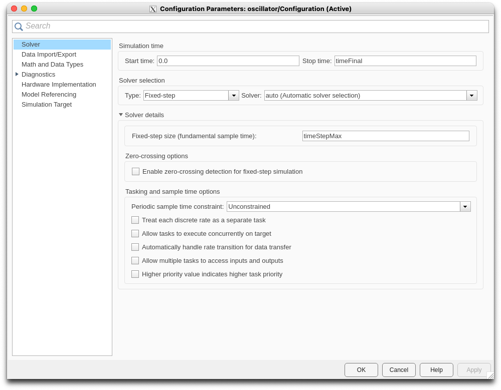
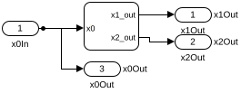

# Hybrid Learner

Hybrid Learner is a research tool for learning complex Cyber-Physical Systems. Our algorithm leverages automaton learning to approximate black-box hybrid systems, streamlining the modeling and testing process. 
Analyze learned models along with additional features such as Simulink model simulation and model transformation from simple text to .SLX format, and checking equivalence of Simulink model files.

## Author

Original author: Amit Gurung <rajgurung777@gmail.com>
Modified by DaiLambda, Inc. <contact@dailambda.jp>

## Installation

- Python 3.10 and `pip`
- Install MATLAB R2022b at `/usr/local/MATLAB/R2022b`
- Install pipenv: `pip install pipenv`
- Install pipenv-shebang: `pip install pipenv-shebang`
- `pipenv --python 3.10`
- `pipenv install --dev`
- `export LANG=C` for correct printing of MATLAB warning and error messages
- [Breach](https://github.com/decyphir/breach) must be in MATLABPATH, ex., `export MATLABPATH=:breach_directory`

### Optional installation

- [pandoc](https://pandoc.org/) in the PATH for HTML reports.

### Recent versions of MATLAB

Recent versions of MATLAB **may** work too by fixing the following fields in `Pipfile`:

- The version constraint of `matlabengine` to the one corresponding to your MATLAB version. Check https://pypi.org/project/matlabengine/#history
- `python_version`, to match with one of `matlabengine` supports.

### Clearning

To start over the installation:

- `pipenv --rm`

## Unit tests

`./run_test`
: Basic unit and short tests.  All tests should run successfully in a few minutes.

## Larger tests and experiments

`tests/*.sh` and `tests/*/*.sh` provide larger scale tests and experiments. Most of them should run successfully, but some are known to fail.

## Learning loop programs

At the toplevel directory, several applications scripts are available:

### `loop.py`

Basic inference loop.

1. Run the original model and get some trajectories.
2. Infer the first generation of learned model from the original trajectories.
3. Run the original and learned model with the same sets of inputs.
4. Compare the trajectories of the two models by the DTW distance and find counter examples.
5. Adds the original trajectories of the counter examples to the learning set and relearn for a learned model of the next generation.
6. Loop back to 3 until no counter examples are found.

### `loop_breach.py`

Inference loop using [Breach](https://github.com/decyphir/breach).

Same as `loop.py` but the simulations and falsifications are done via Breach.

The DTW distance is not possible to compute easily in MATLAB nor STL (Signal Temporal Logic).  We use the sum of absolute errors $\Sigma_t |v(t) - v'(t)|$ instead and check whether it exceeds the threshold or not.

### `loop_by_spec.py`

Falsification by a specification in STL.

Instead of comparing trajectories between the original and learned models, this loop checks the trajectories of the learned models satisfy the specification given in STL formula.

## Tools

### `plot_ts.py`

Timeseries plotter to SVG

### `slx_ports.py`

List IO ports of a model

### `slx_paramters.py`

List the list of model parameters

## Smaller tools

The functionalities of these small tools are integrated in the learning loop programs.

### `comple_ha.py`

Hybrid Automaton in JSON to MATLAB SLX model compiler

### `simulate.py`

Simulator of modles in SLX

### `inference.py`

Hybrid Automaton inference

### `generate_simulation_script.py`

Simulation script generator. Deprecated. Use `simulate.py` instead.

### `generate_simulation_inputs.py`

Simulation input generator.  Deprecated. Use `simulate.py` instead.

### `distance.py`

DTW distance between 2 trajectories

## Tool options

### Common options

`--input-variables <variables>`
: List of input variable names, separated by commas.  

  These variables correspond with the input ports of the models. The input variable names can be different from the corresponding input port names, while their ordering must be the same. 
  
  For example, if a model has 3 input ports and you specify `--input-variables 'x1,x2,x3'`, `x1` is for the first input port, `x2` is for the second, and `x3` is for the third.

  **Note**: Python keywords such as `def`, `if`, etc., cannot be used as variables, since many option strings are parsed as pieces of Python expressions.
  
`--output-variables <variables>`
: List of output variable names, separated by commas.

  The same remarks as the input variables apply for the output variables:   these variables correspond with the output ports of the models. The output variable names can be different from the corresponding output port names, while their ordering must be the same.

`--output-directory <dir>`
:  Specifies the directory for the output files.  Hybrid Learner programs usually produce multiple files including intermediate ones.  This option controls the place for the output.
    
### Simulation options

Declared at `hybridlearner.simulation.options`

`--time-horizon <float>` or `-Z <float>`
: Total time of simulation.

  The models are simulated between time $0$ and this time horizon.
  
`--sampling-time <float>` or `-s <float>`
: Length of each simulation time frame.

`--fixed-interval-data`
: If given, variable step timeseries are coerced to fixed step timeseries.

  Hybrid Learner cannot handle variable step timeseries but only fixed step ones. This option is intended to coerce variable step timeseries of some models to fixed ones.
  
  **❗️NOTE❗️:** This option is NOT recommended to use, since the coercion quality is very low.

`--invariant <variable:range pairs>`
:  Variable ranges. For the input variables, the ranges are used for the random selection of control point values. For the output variables, the ranges are used to random-pick the initial output values.

   Example: `--invariant 'i1:(10,20), i2:(30,40), o1:(0.0,1.2)'`

`--number-of-cps <variable:number pairs>`
:  Number of control points to generate the input data of the input variables.

   For example, with `--number-of-cps 'x1:3, x2:5'`, the input data generation for `x1` will have 3 control points and the generation for `x2` will have 5 control points.

`--signal-types <variable:type>`
:  Interpolation method to generate the input time series for the input variables from their control points.  Currently, `fixed_step` and `linear` are available.

   Example: `--signal-types 'i1:linear, l2:fixed_step'`

`--seed <int>` or `-S <int>`
:  Random seed for the simulation input generation.

   **BUG**: currently this seed is NOT used for simulations by Breach.

### Inference options

Declared at `hybridlearner.inference.options`.

`--ode-degree <int>` or `-d <int>`
:  Degree of polynomial in ODE. Set to 1 by default

`--guard-degree <int>' or `-b <int>`
: Degree of polynomial inequalities for Guards. Set to 1 by default

`--annotations <variable-annotation pairs>`
:  Variable type annotations. The following type annotations are available:
   - `continuous`: keep the value at transitions
   - `pool(<float>, .., <float>>)`: ❓❓❓
   - `constant(<float>)`: reset the value to the specified at transitions

   For example, `--annotations 'x1:continuous, x2:constant(0.0), x3:pool(1.0, 1.1, 1.2)'`

`--is-invariant <True|False>`
:  If True (default) computes invariant and False disables computation

`--filter-last-segment <True|False>`
:  True to enable and False to disable (default) filtering out the last segment from a trajectory during segmentation

#### Clustering options

Declared at `hybridlearner.inference.clustering.options`.
    
`--clustering-method <method>` or `-c <method>`
: Clustering Algorithm. Options are:

  - `dtw` (default)
  - `dbscan` (currently disabled)
  - `piecelinear` (currently disabled)

`--modes <int>` or `-m <int>`
: Number of modes. Used only in `piecelinear` clustering algorithm. Set to 1 by default

`--segmentation-error-tol <float>`
:  Maximal relative-difference (FwdBwd) error tolerated during segmentation. Set to 0.01 by default

`--segmentation-fine-error-tol <float>`
:  Maximal relative-difference (Bwd) fine-error tolerated during segmentation. Set to 0.01 by default

`--lmm-step-size <int>`
:  Options are: 2/3/4/5/6. Higher values computes more accurate derivatives. 5 is set default

`--threshold-correlation <float>`
:  Maximal threshold for correlation value in DTW clustering algorithm. Set to 0.8 by default

`--threshold-distance <float>`
:  Maximal threshold for distance in DTW clustering algorithm. Set to 0.1 by default

`--ode-sppedup <int>`
: Maximum number of segments to include for ODE computation. Set to 10 by default

`--dbscan-eps-dist <float>`
:  Maximal threshold for distance in DBSCAN clustering algorithm. Set to 0.01 by default'.

`--dbscan-min-samples <int>`
:  Maximal threshold for min-samples in DBSCAN clustering algorithm. Set to 2 by default

### Compiler options

Declared at `hybridlearner.slx.compiler_opitions`.

`--ode-solver-type <type>`
:  Set the ODE solver type of the compiled model. Either `variable` or `fixed`.

`--ode-solver <solver name>`
:  Set the ODE solver name, such as `FixedStepAuto` and `ode45`.

`--invariant-mode`
:  Invariant mode: (0: Both, 1: Output, 2: None)

The options `--ode-solver-type` and `--ode-solver` control the model simulation configuration. In Simulink you can access them at: MODELING > Model Settings > Solver selection
    
### Application level options
    
Declared at each application.

`--simulink-model-file`
: The path of the original model in SLX

`--counter-example-threshold <float>`
:  Distance threshold for counter examples

`--nsimulations <int>` or `-n <int>`
:   Number of simulations per inference iteration

`--max-nloops <int>`
:  Max number of inference loops

`--skip-already-tried-parameters <True|False>`
:  If `True`, Breach falsification skips the input parameters considered counter examples in the previous iterations in `loop_breach.py`.
    
   Note that this skipping is not intended use of Breach and may affect its efficient counter example finding algorithm.

`--stl-spec <expr>`
:  Specification in STL for `loop_by_spec.py`.

## Model assumptions

HybridLearner can handle Simulink models with the following properties.
 
### Model settings

A Simulink model must have the following solver settings:

- Simulation time
  - Start time: `0.0`
  - Stop time: `timeFinal`
- Solver selection
  - Type: `Fixed-step`
  Type can be `Variable-step`, but `-fixed-interval-data` is required for the simulation tools to coerce variable step timeseries to fixed ones.  Unfortunately the quality of the coercion is not very good for the moment.
  - Solver: can be anything
- Solver details
  - Fixed-step size `timeStepMax`, if `Fixed-step` solver is selected.
    > Note: Yes, it is a strange name.

You can edit these settings from Simulink GUI at 
MODELING > Model Settings > Solver:

### IO ports

HybridLearner assigns the list of input $[i_1,\dots,i_n]$ and output variables $[o_1,\dots,o_m]$ to a Simulink model.  The Simulink model must have the following IO ports:

* Input ports $[I_1,\dots,I_n]$, corresponding with the input variables $[i_1,\dots,i_n]$.  The ordering must be preserved.
* Output ports $[O_1,\dots,O_m,\bar{I}_1,\dots,\bar{I}_n]$, corresponding with the list of variables $[o_1,\dots,o_m,i_1,\dots,i_n]$.  The ordering must be preserved.
* The signals of the input ports $[I_1,\dots,I_n]$ must be directly sent to the corresponding output ports $[\bar{I}_1,\dots,\bar{I}_n]$.
* Variable names $i_1,\dots,i_n,o_1\dots,o_m$ and the names for the IO ports $I_1,\dots,I_n,O_1\dots,O_m,\bar{I}_1,\dots,\bar{I}_n$ **can be different**.

The following SLX model follows the above port conditions:

- 1 input port `x0In`
- 3 output ports `x1Out`, `x2Out` and `x0Out`.
    - The first 2 output ports `x1Out` and `x2Out` are for 2 output variables
    - The last output port `x0Out` is directly connected to the input port `x0In`.

> Note: It is not essential to have the output ports for the input variables $\bar{I}_j$. `simulation.py` requires these ports but we can fix it.

### Initial values of output variables

The initial values of the output variables $o_1,\dots,o_m$ are set by MATLAB variables $a_n$, ..., $a_{n+m-1}$, where $n$ is the number of the input variables:

- $a_n$ : the initial value of $o_1$
- $a_{n+1}$ : the initial value of $o_2$
- ...
- $a_{n+m-1}$ : the initial value of $o_m$

> Note: Yes, this offseting is pretty annoying! 😡

HybridLearner sets these variables to configure the initial conditions of simulations. 

The model must use the values in these variables $a_n$,...,$a_{n+m-1}$ for the first output values of the output port $O_1$,...,$O_m$.
