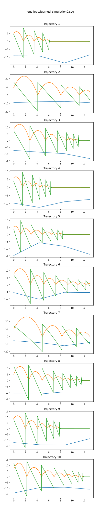
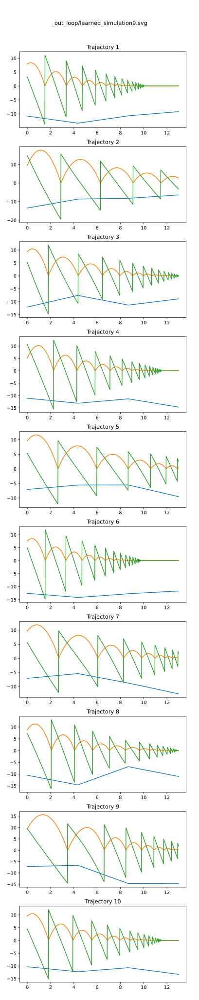
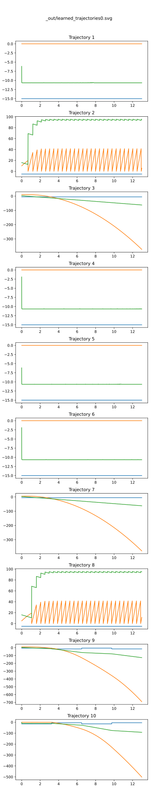

# Hybrid Learner report 20241018

Based on commit `02ef54c966b861ea29d3ddb498b22fb56ea3dd8c`

## Learning loop algorithm

1. Run just 1 simulation of the original model and let its trajectory be the initial learning set.
2. Infer a new learned model from the current learning set.
3. Run 10 simulations both of the original and the latest learned model.
4. Extract the counter examples. If no counter example found or it loops 10 times, terminate the loop.
5. Add the counter examples to the current learning set, then loops back to 2.

## Bouncing ball simulation, with legacy loop in Python using DTW distance

Command: `tests/test_loop.sh`

### The initial inference

The initial inference produces the following automaton.

- Only 1 mode
- The ODEs for `x` and `v` are already very acculate.
- The guard assignments are also very acculate.
- The guard is **not very good**. It is mainly goverened by `x` but with non-negligiable coefficients for `u` and `v` and a constant.

ODE:

- x' = u * 1.43e-10 + x * 1.93e-10 + v * 1.00 + 3.33e-11
- v' = u * 1.00 + x * 1.21e-07 + v * 5.35e-08 + 2.33e-06

Transition:

- guard: u * 0.267 + x * 39.4 + v * 0.109 + 0.722 < 0
- assigment:
  - x = u * 0.0 + x * 0.0 + v * 0.0 + 0.0
  - v = u * 3.18e-15 + x * 1.18e-13 + v * -0.800 + 1.24e-14

Trajectories:

- Bouncing nicely at the beginning.
- When the bouncing speed goes below some point, it starts "boucing immediately again and again" which keeps the ball on the ground. Trajectory 1, 4 and 9 are such good examples. This seems to be caused by the inprecise guard.

### 10th inference

At the last inference, we have:

- Only 1 mode
- The ODEs for x and v are very acculate.
- The guard assignments are very acculate.
- The guard is not perfect but much better than the first.

ODEs:

- x' = u * 2.68e-11 + x * 2.25e-11 + v * 1.00 + 3.41e-10
- v' = u * 1.00 + x * 8.00e-08 + v * 4.28e-08 + 1.98e-06

Transitions

- guard : u * -0.0124 + x * 38.3 + v * 0.381 + -0.193 < 0
- assignments:
  - x = u * 0.0 + x * 0.0 + v * 0.0 + 0.0
  - v = u * -1.43e-16 + x * 3.81e-14 + v * -0.799 + 2.66e-15

Trajectories:

- The boucing curves look very similar to the original trajectories.

### Considerations

- The inaccuracy of the guard is caused by **the small numbers of the samples**: 
  if the initial speed is high, a trajectory has less than 10 bounces.
  - It is waste of time to run the whole learning process again and again to have better guards.  How about **"intense learning focused around the transitions"**?
- Bouncing immediately issue: could be eased by an additional user supplied condition **v < 0**

## Bouncing ball simulation, with loop using Breach

This new learning loop uses Breach for simulation and falsification.

Command: `tests/test_loop_breach.sh`

### The initial inference

- Only 1 mode
- ODEs are very acculate already
- Guard is broken: x's coefficient is negative.
- Assignment is also broken.

ODEs:

- x' = u * 1.70e-06 + x * -3.35e-07 + v * 1.00 + 2.04e-05
- v' = u * 0.999 + x * 6.59e-05 + v * -1.05e-06 + -0.00202

Transition:
- guard: u * 1.60 + x * -0.916 + v * 0.253 + 23.0 < 0
- assignments:
  - x = u * 0.0 + x * 0.0 + v * 0.0 + 0.0
  - v = u * 7.21 + x * -1.96 + v * 0.327 + 101

Trajectories:

- Very weird due to the negative guard coefficient of x.
- The guard is triggered at the first sample of Trajectory 1, 4, 5 and 6,
	setting the speed 0 and warps the position below 0.
- Trajectory 3, 7, 9 and 10 fail to trigger the guard.
- Trajectory 2 and 8 "bounce" very strangely.

### The 10th inference

**Exactly the same results** as the first inference.

- Breach falsification is **not random** at all.
  Each falsification tries **the same set of initial conditions**.

### Considerations

- Falsification must avoid using the initial conditions 
  already tried in the prior falsifications.
  - We need a way to **avoid already tried initial conditions**.
  - Also nice to add some randomness to the falsification parameter generation.
- STL is not powerful enough to compute DTW distance.
- STL formula like `alw (abs(out_a1[t] - out_b1[t]) < 0.1)`
  is very fragile for the ball speed which flips largely (i.e. $* -0.8$)
  at tiggers, since the trigger timings may likely shift 1 frame.
  - Can Matlab compute something like $min(abs(x[t-5,..,t+5], x'[t]))$?

## Overall considerations

- Full floating point representation like
  `u * 1.701248228898177e-06 + x * -3.351694719960774e-07 + v * 1.000000046832158 + 2.041383537122049e-05` is not good for human understanding.
  It is better to have a human friendly report like
	  `u * 1.70e-06 + x * -3.35e-07 + v * 1.00 + 2.04e-05` instead.
- Nice if we can have the original and learned model trajectories in the same plot.
- Automatic report generator like this document.

